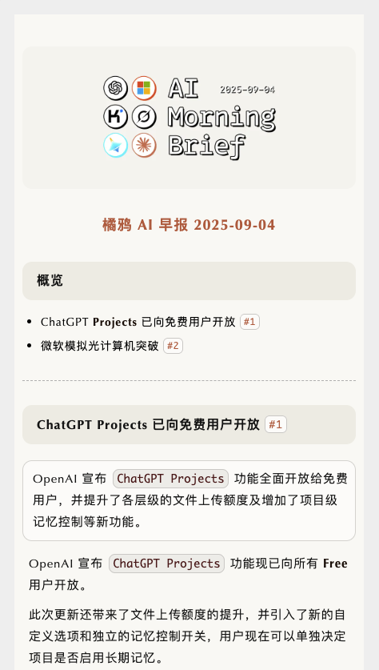

# md2juya

将 Markdown 转换为 Juya AI 日报样式的微信 H5 推送内容，用于自动化的发布 workflow。

## 支持的Markdown语法

| 语法类型 | Markdown语法 | 样式特征 | 特殊功能 |
|---------|-------------|----------|----------|
| **一级标题** | `# 标题` | 橘色居中大字体 | 作为文档主标题 |
| **二级标题** | ``## 标题 `#1` `` | 米色背景 + 绿色底线 + 圆角 | 支持内联代码样式 |
| **段落文本** | `普通文本` | 标准段落样式 | 支持内联代码样式 |
| **无序列表** | `- 列表项 #1` | 自动编号 + 橘色标签 | 支持内联代码样式 |
| **引用块** | `> 引用内容` | 米色背景 + 圆角边框 | 支持文本样式 |
| **代码块** | ` ```代码``` ` | 白色背景 + 灰色边框 + 圆角 | 未实现语法高亮 |
| **内联代码** | `` `代码` `` | 米色背景 + 橘红色文字或灰色背景 + 棕色文字 | 其他或纯文本段 |
| **粗体文本** | `**粗体**` | 加粗 | - |
| **图片** | `` | 圆角 + 居中容器 | 自适应响应式 |
| **分割线** | `---` | 虚线样式分隔 | 标准章节分割 |
| **表格** | `\| 列1 \| 列2 \|` | 奇偶行交替背景 + 边框 | 加粗表头 |

## 快速开始

### 命令行使用（用于本地预览）
```bash
# 安装为全局命令
npm install -g md2juya

# 基础转换（生成 input_juya.html）
md2juya input.md

# 指定输出文件名
md2juya input.md output.html
```

### 开发接口（用于推送 workflow 集成）

#### 基础用法
```typescript
import { convertToJuyaH5 } from 'md2juya';

const markdown = `


# 橘鸦 AI 早报 2025-09-04

## 概览

- ChatGPT **Projects** 已向免费用户开放 #1
- 微软模拟光计算机突破 #2

---

## ChatGPT Projects 已向免费用户开放 #1

> OpenAI 宣布 `ChatGPT Projects` 功能全面开放给免费用户，并提升了各层级的文件上传额度及增加了项目级记忆控制等新功能。

OpenAI 宣布 `ChatGPT Projects` 功能现已向所有 **Free** 用户开放。

此次更新还带来了文件上传额度的提升，并引入了新的自定义选项和独立的记忆控制开关，用户现在可以单独决定项目是否启用长期记忆。

| 用户层级 | 单次项目文件上传上限 |
| --- | --- |
| Free | 5个 |
| Plus | 25个 |
| Pro/Business | 40个 |


---

## 微软模拟光计算机突破 #2

> **Microsoft Research Cambridge** 团队成功研发出模拟光计算机，并在证券结算和MRI扫描加速两大实际问题中验证了其可行性，展现出超越传统GPU的能效与速度潜力。

**Microsoft Research Cambridge** 团队历时四年打造的模拟光计算机（`AOC`）首次在两项高价值优化任务中展现卓越性能，为涉及证券结算和MRI扫描加速两大实际问题中验证了其可行性，展现出超信传统 **GPU** 实现百倍能效及百倍速度提升。在 `AI` 方向，它已能完成小型机器学习任务，并展示了在状态跟踪类推理中的低能耗潜力。

该设备由常用 `micro-LED`、智能手机镜头与传感器组装成，当前原型包含 **256** 个数量参数，后续计划每两年迭代一次并扩展至百万至千万级数量。
`;

// 获取HTML内容和KB大小
const { html, sizeKB } = convertToJuyaH5(markdown);

// 检查微信1MB限制
if (sizeKB > 1024) {
  console.warn('内容超过微信1MB限制，建议减少内容');
}

// 用于微信公众号API调用
const articleData = {
  title: "AI早报 2025-09-04",
  content: html,  // 纯HTML片段
  // ... 其他API字段
};
```

### 效果演示

<table>
<tr>
<td align="center" width="50%">

<br/>
</td>
<td align="center" width="50%">

<br/>
</td>
</tr>
</table>

#### 高级用法
```typescript
import { JuyaH5Maker } from 'md2juya';

const maker = new JuyaH5Maker();

// 使用解构赋值获取HTML内容和KB大小
const { html, sizeKB } = maker.convert(markdown, true);
```

**TODO:**

- [ ] 自定义样式覆盖
- [ ] 主题系统

### 本地开发
```bash
npm install
npm run build

# 创建全局命令链接（用于本地测试）
npm link

# 现在可以全局使用md2juya命令
# 或直接使用node dist/cli.js example.md
md2juya example.md

# 修改代码后重新构建即可（无需重新link）
npm run build

# 开发完成后，取消全局链接
npm unlink -g md2juya
```

## 项目结构

```
src/
├── styles.ts      # 样式配置 - 从原始微信HTML精确提取
├── converter.ts   # 核心转换逻辑 - 自定义marked.js渲染器  
├── index.ts       # 包主入口 - 导出API接口
└── cli.ts         # CLI工具 - 命令行接口
```

## H5内容边界说明

工具输出内容为纯HTML正文片段（如 `<h2>标题</h2><p>内容...</p>`），用于微信API的 `content` 字段。不包含：`<html>`, `<head>`, `<body>` 等完整页面结构。
